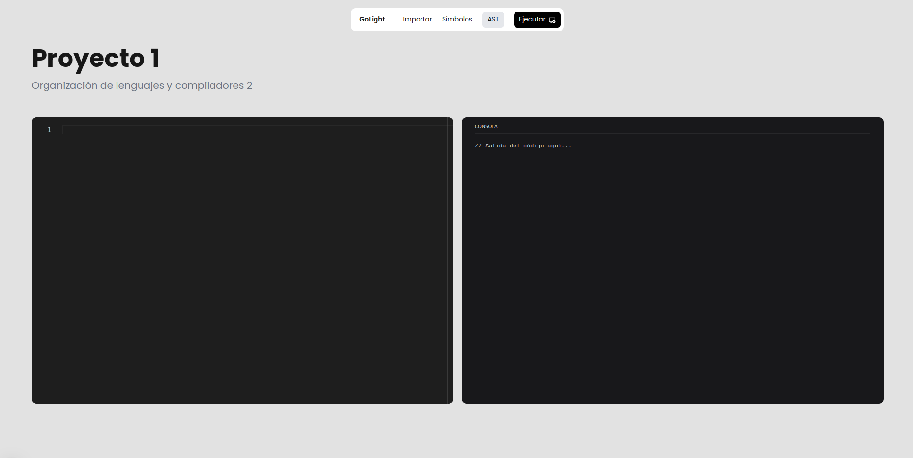
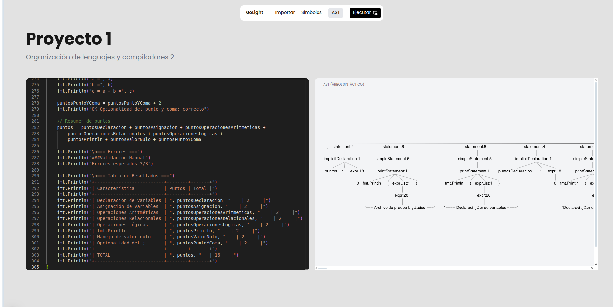

# Manual de usuario
## OLC2 - Lenguajes Formales y de Programación
### 202300376 - Jorge Andrés Mejía

Este manual tiene como objetivo explicar el funcionamiento de la aplicación web que se ha desarrollado para el proyecto de la asignatura de Organización de Lenguajes y Compiladores 2.
La aplicación consta de distintas funcionalidades que permiten al usuario realizar distintas acciones con un lenguaje de programación creado para el proyecto, el cuál cuenta con una sintaxis y semántica definida similar a GoLang.

## Índice

- [Manual de usuario](#manual-de-usuario)
  - [OLC2 - Lenguajes Formales y de Programación](#olc2---lenguajes-formales-y-de-programación)
    - [202300376 - Jorge Andrés Mejía](#202300376---jorge-andrés-mejía)
  - [Índice](#índice)
  - [Interfaz](#interfaz)
    - [Editor de código](#editor-de-código)
    - [Consola de salida](#consola-de-salida)
    - [Árbol de análisis](#árbol-de-análisis)
    - [Símbolos](#símbolos)
  - [Sintaxisvez, se incluye la definicion de comentarios de una sola linea y multilinea.](#sintaxisvez-se-incluye-la-definicion-de-comentarios-de-una-sola-linea-y-multilinea)
      - [Asignación de slices// Acceso a elementos en un slice](#asignación-de-slices-acceso-a-elementos-en-un-slice)
      - [Ciclos](#ciclos)
      - [Declaraciones de control](#declaraciones-de-control)

## Interfaz




En esta sección se muestra el árbol de análisis sintáctico del código fuente. En caso de que existan errores en el código, estos se mostrarán en esta sección.


La interfaz de la aplicación web se divide en distintas secciones principales:

### Editor de código

En esta sección se puede escribir el código fuente del lenguaje de programación creado para el proyecto. El editor cuenta con las siguientes funcionalidades:

- Resaltado de sintaxis
- Autocompletado

### Consola de salida

En esta sección se muestra la salida de la ejecución del código fuente. En caso de que existan errores en el código, estos se mostrarán en esta sección.

### Árbol de análisis


En esta sección se muestra el árbol de análisis sintáctico del código fuente. En caso de que existan errores en el código, estos se mostrarán en esta sección.ables y muestra el resultado en la consola de salida.
`z` es una variable de tipo `int` que se declara de forma implícita utilizando el operador `:=`.
### Símbolos
En esta sección se muestra la tabla de símbolos generada durante la ejecución del código fuente. Incluye información sobre los identificadores declarados y sus valores.mación creado para el proyecto, como ciclos, condicionales, funciones, entre otros.

## Sintaxisvez, se incluye la definicion de comentarios de una sola linea y multilinea.

El lenguaje de programación creado para el proyecto cuenta con una sintaxis similar a GoLang. A continuación se muestra un ejemplo de un programa escrito en el lenguaje:`go
rio de una sola linea
```go
var x int = 10;ario
var y int = 20;
rias
z := x + y;eas
*/
fmt.Println(z);
```

El código anterior declara dos variables `x` y `y` de tipo `int`, realiza la suma de dichas variables y muestra el resultado en la consola de salida.
`z` es una variable de tipo `int` que se declara de forma implícita utilizando el operador `:=`.programación creado para el proyecto cuenta con los siguientes tipos de datos:

Existen distintas funcionalidades que se pueden utilizar en el lenguaje de programación creado para el proyecto, como ciclos, condicionales, funciones, entre otros.

A su vez, se incluye la definicion de comentarios de una sola linea y multilinea. de texto

```go
// Comentario de una sola lineao
/*structura
Comentario- `func`: Función
de
varias
lineas
*/
```a el proyecto cuenta con los siguientes operadores:

### Tipos de datos*`, `/`, `%`
!=`, `<`, `>`, `<=`, `>=`
El lenguaje de programación creado para el proyecto cuenta con los siguientes tipos de datos:

- `int`: Entero
- `float`: Decimal, `>>`
- `string`: Cadena de texto- Puntuación: `;`, `,`, `()`, `{}`, `[]`
- `bool`: Booleanoios: `//`, `/* */`
- `rune`: Caracter
- `array`: Arreglo
- `struct`: Estructura
- `func`: Funciónde slices, que son arreglos dinámicos. Los slices pueden ser de una o dos dimensiones y se pueden inicializar y asignar de diferentes maneras.
- `nil`: Nulo
Declaración e inicialización de slices
### Operadores

El lenguaje de programación creado para el proyecto cuenta con los siguientes operadores:// Declaración e inicialización de un slice de enteros

- Aritméticos: `+`, `-`, `*`, `/`, `%`
- Relacionales: `==`, `!=`, `<`, `>`, `<=`, `>=`// Declaración e inicialización de un slice de cadenas
- Lógicos: `&&`, `||`, `!`
- Asignación: `=`, `:=`
- Incremento/Decremento: `++`, `--` e inicialización de un slice bidimensional
- Otros: `&`, `|`, `^`, `<<`, `>>`int{
- Puntuación: `;`, `,`, `()`, `{}`, `[]`
- Comentarios: `//`, `/* */`  {4, 5, 6},
 {7, 8, 9},
### Slices};

El lenguaje de programación soporta el uso de slices, que son arreglos dinámicos. Los slices pueden ser de una o dos dimensiones y se pueden inicializar y asignar de diferentes maneras.

#### Declaración e inicialización de slices
sible asignar un nuevo slice a una variable existente, siempre y cuando ambos sean del mismo tipo.
```go
// Declaración e inicialización de un slice de enteros
numeros := []int{1, 2, 3};// Asignación de un nuevo slice a una variable existente

// Declaración e inicialización de un slice de cadenas
nombres := []string{"Juan", "Ana", "Luis"};un nuevo slice bidimensional

// Declaración e inicialización de un slice bidimensional  {10, 11, 12},
matriz := [][]int{ {13, 14, 15},
    {1, 2, 3},};
    {4, 5, 6},
    {7, 8, 9},
};Acceso y modificación de elementos en slices
```

#### Asignación de slices// Acceso a elementos en un slice

Es posible asignar un nuevo slice a una variable existente, siempre y cuando ambos sean del mismo tipo.

```gonumeros[1] = 10;
// Asignación de un nuevo slice a una variable existente
numeros = []int{4, 5, 6, 7};
// Acceso a elementos en un slice bidimensional
// Asignación de un nuevo slice bidimensional
matriz = [][]int{
    {10, 11, 12},
    {13, 14, 15},riz[2][1] = 20;
};fmt.Println(matriz); // Imprime: [[10, 11, 12], [13, 14, 15], [7, 20, 9]]
```

#### Ciclos

```go
// Ciclo while
while condicion {
    // Código a ejecutar mientras la condición sea verdadera
}

// Ciclo for
for i := 0; i < 10; i++ {
    // Código a ejecutar en cada iteración
}

// Ciclo for-range
for indice, valor := range slice {
    // Código a ejecutar para cada elemento del slice
}
```

#### Declaraciones de control

```go
// Declaración break
break;

// Declaración continue
continue;

// Declaración return
return valor;
```

Con estas funcionalidades, el lenguaje de programación creado para el proyecto permite desarrollar aplicaciones complejas y eficientes, facilitando la manipulación de datos y el control de flujo en diferentes contextos.


